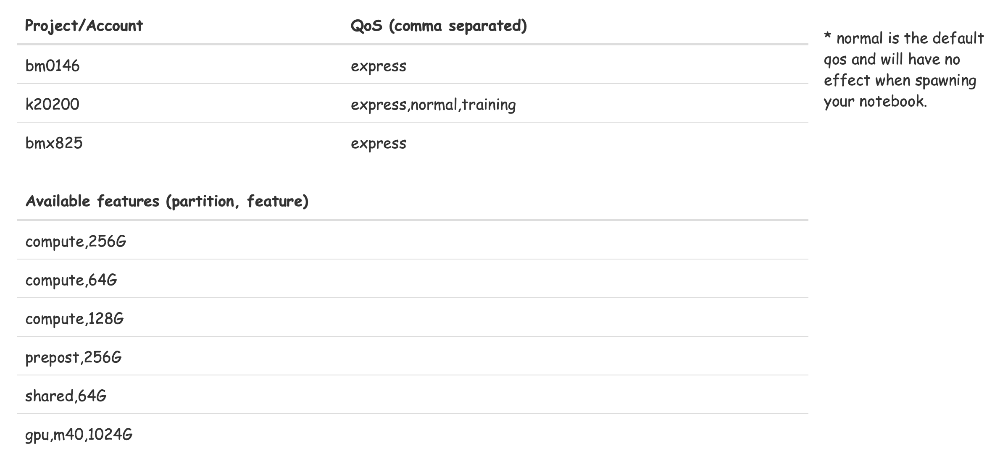
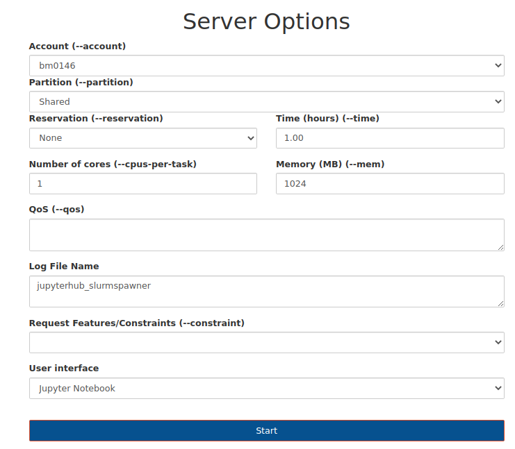
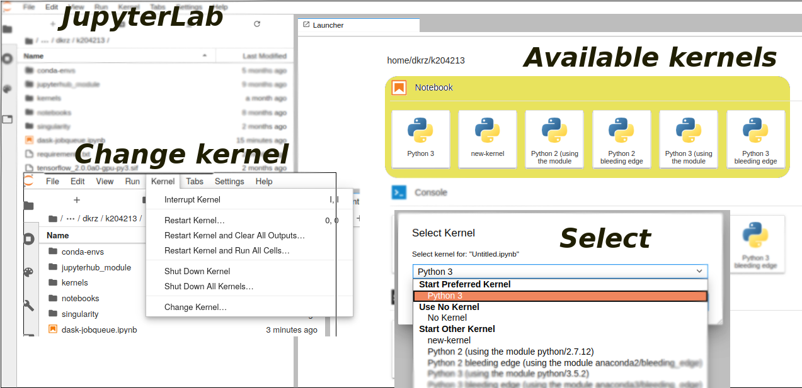
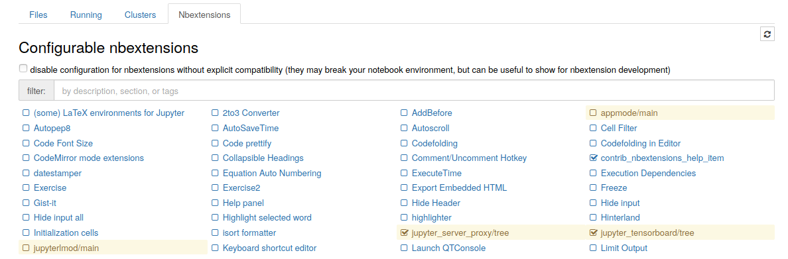
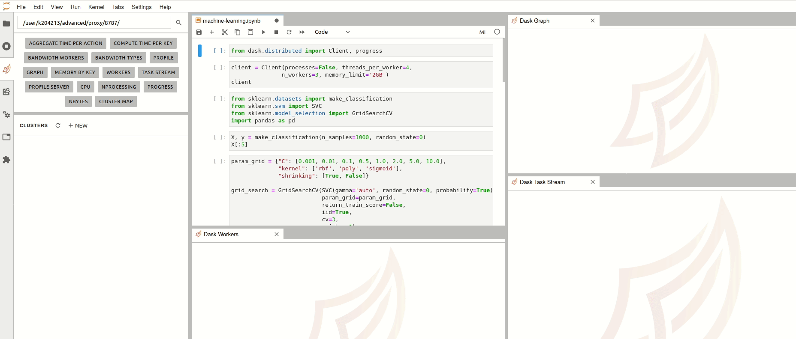

## Jupyter * @ DKRZ
#### Interactive (Super) computing on Mistral

 | {: width="470" style="border:none"}

**Sofiane Bendoukha**

Deutsches Klimarechenzentrum (DKRZ)


<p style="font-size:14px"> * : hub/notebooks/lab/kernels </p>


```note

```

---

### Agenda

* Introduction 
* {:.fragment} Spawning process
* {:.fragment} Kernels
* {:.fragment} Q & A


***

### **Introduction**

---

## What is, Why Jupyter?


The Jupyter Notebook
> The Jupyter Notebook is an open-source **web application** that allows you to **create** and **share** documents that contain **live code**, equations, **visualizations** ... Uses include:  statistical modeling, data visualization, machine learning, and much more.
                                                                               ... jupyter.org
                                          
---


## Jupyter Notebook on HPC

Using Anaconda, anyone can install and run Jupyter Notebooks on their local computer. However, to be able to run Jupyter Notebooks on a remote shared resource like our HPC, one would need to log into the HPC cluster, use the commandline to reserve computing resources and set up some cumbersome SSH tunneling as described here. A more convenient way to run Jupyter Notebooks on a shared resource is using JupyterHub.

---


<div class="row">
  <div class="column">
    
  </div>
  <div class="column">
    <ul>
  <li>Need for more <bold>"human-in-the-loop"</bold> workflows due to huge growth in data creation</li>
  <li>Rapid iteration with tools like Jupyter notebooks</li>
  <li>In situ data analytics</li>
  <li>Adaptive scaling of computing resources</li>
</ul>
  </div>
</div>


---

## What we provide


* {:.fragment} **Old way**: Single Jupyter notebooks (ssh based)
  * [source](https://www.dkrz.de/up/systems/mistral/programming/jupyter-notebook)
  * limited support
  * commandline based
  * ```./start_jupyter [Options]```  
* {:.fragment} **Convenient way**: **Jupyterhub** 
  * user-friendly
  * full user support 
  * continuous maintenance and update 
  
---

## How it works?


<small>https://jupyterhub.readthedocs.io/en/stable/</small>
---

## How it works on Mistral?

 
---

## Roadmap


---

### **What's new in Jupyterhub 2.0?** 


 
* New (DKRZ) Spawner
* Added new partitions
* Added services for announcements and project accounts 
* New Sphinx-based documentation
* New frontend 
* Different spawner options (preset and advanced)
* Enabled loading own python environments (kernels)
* Enabled jupyter notebook extensions 
* ... 

---

### GUI


{: style="border:none;" height="555" width="850" } 


---

### REST Web services
 

* announcements 
   
* accounts
   

---

### Documentation

{: width="870px" height="520px" style="float:center; border:none"}


***
***

# Spawner options

---

### Overview

---

### Preset options form 

{: width="400px" style="border:none"}


|----------|-------------|
| <small>shared partition; 1,2 or 4 cores (2.5 GByte memory per core) </small>| <small> small development/testing projects </small> |
| <small> prepost partition; 1,2 or 4 cores (2.5 GByte memory per core) </small> | <small> as before, but allowing access outside of mistral (wget or similar) </small> |
| | |
 

---

### Advanced options form

{: width="550" style="border:none"}

---

### Named servers

| {: width="1700px" style="border:none"}  | `* Named servers allow you to have more than one server running in the same time`<br/>`* skype` 

***
***

# Kernels 

---

## Default system kernels

| Kernel   |  Source module |
|----------|-------------|
| Python 2 |  python/2.7.12 |
| Python 2 |  anaconda2/bleeding_edge  |
| Python 3 | anaconda3/bleeding_edge |
| <span style="color:blue">*Python 3 unstable*</span> | <span style="color:blue">*python3/unstable*</span> |


---

## Bring your own environment 

* Conda 
```

  % mkdir $HOME/kernels
  % conda create --prefix $HOME/kernels/your-kernel ipykernel python=3.x
  % source activate $HOME/kernels/your-kernel
  % python -m ipykernel install --user --name new-kernel --display-name="new kernel"
  % conda deactivate 
```

* Virtualenv
```
% python -m pip install --user virtualenv
% python -m virtualenv --system-site-packages /path/to/new-kernel
% source /path/to/new-kernel/bin/activate
% pip install ipykernel
% python -m ipykernel install --user --name new-kernel --display-name="new-kernel"
```

---

## Using/Changing the kernels

{: width="1000px" style="border:none"}

---

## Using/Changing the kernels

{: width="730px"  style="border:none"}


***
***

## Jupyter extensions (1)


{: style="border:none"}


```note
jupyter notebooks are kind of add-ons to extend the basic environment of a jupyter notebook.
```

---

## Jupyter extensions (2)


{: width="850px" height="400px" style="border:none"} 


***
***

## Future work 

* Sharing solutions
  * shared notebooks repositories (Git/hub/lab)
  * external sharing services: Cloud (?)  
* Enhanced spawning queue for Jupyterhub
* More dedicated system kernels and extensions (e.g. ML)
* Speed up loading Python packages
* Binder for Mistral 

---

## Feedback? Questions?

* [Jupyterhub](https://jupyterhub.dkrz.de)
* [Documentation](https://jupyterhub.gitlab-pages.dkrz.de/jupyterhub-docs/index.html)
* support@dkrz.de